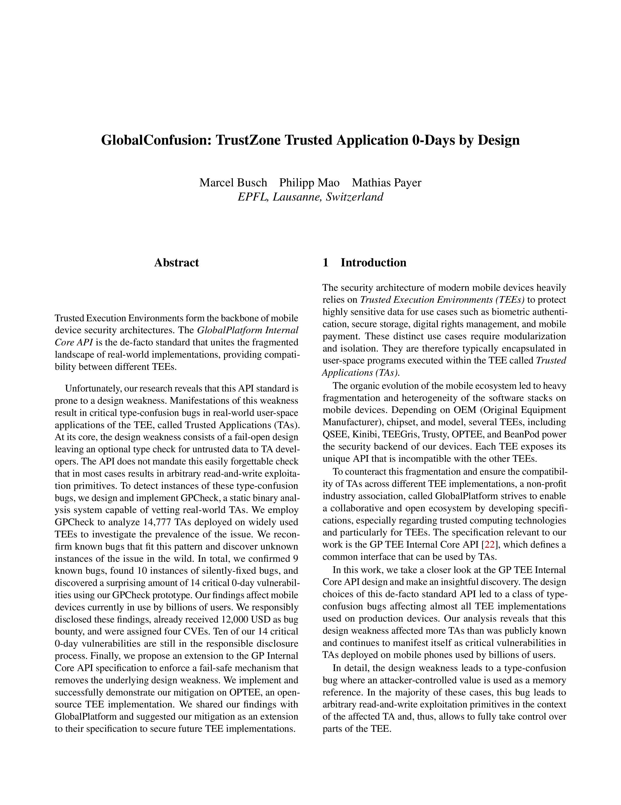

# GlobalConfusion: TrustZone Trusted Application 0-Days by Design

<a href="http://hexhive.epfl.ch/publications/files/24SEC1.pdf">  </a>

This repository contains the artifacts for our USENIX SEC'24 paper <a href="http://hexhive.epfl.ch/publications/files/24SEC1.pdf">GlobalConfusion: TrustZone Trusted Application 0-Days by Design</a>.

If you use our artifacts or want to refer to "GlobalConfusion" in a scientific publication, we would appreciate a citation using this Bibtex entry: 

```
@inproceedings{busch2024globalconfusion,
  author       = {Marcel Busch and
                  Philipp Mao and
                  Mathias Payer},
  title        = {GlobalConfusion: TrustZone Trusted Application 0-Days by Design},
  booktitle    = {33st {USENIX} Security Symposium, {USENIX} Security 2024, Philadelphia,
                  PA, USA, August 14-16, 2024},
  publisher    = {{USENIX} Association},
  year         = {2024},
  url          = {https://www.usenix.org/conference/usenixsecurity24/presentation/busch1}
}
```

## SETUP :wrench:

We tested our setup on Ubuntu 22.04.2 using Docker version 23.0.1 and the
docker-compose plugin version 1.29.2.

```bash
make build # docker compose build the images
```

## HOWTO

Under `data/new/`, you can find two pre-compiled TA binaries (`000cafee-*.elf` and `001cafee-*.elf`).
The corresponding source code can be found in `test/00{0,1}-tipi`.
`000cafee` does not contain the GP type-confusion vulnerability while `001cafee` does.

When running the analyses against specific binaries, you can provide the
`TARGET`, the `TEE`, and a `TIMEOUT`
(`TEE={vivo_kinibi,oppo_kinibi,qualcomm,mitee}`).  The binaries have to be in
`data/new/` when using the docker setup.


To analyze the two pre-compiled binaries run:
```
make run-tipi TARGET=000cafee-2450-11e4-abe2-0002a5d5c51b.elf TEE=optee TIMEOUT=600
make run-tipi TARGET=001cafee-2450-11e4-abe2-0002a5d5c51b.elf TEE=optee TIMEOUT=600
```

The results will be stored in a TA-specific directory under `data/analysis/`:
```
data/analysis/000cafee-2450-11e4-abe2-0002a5d5c51b.elf:
report.json

data/analysis/001cafee-2450-11e4-abe2-0002a5d5c51b.elf:
report.json
```

The `report.json` contains the analysis results.  Each report should contain a
key `is_vuln` with a boolean value that indicates if the TA is vulnerable to
the GP type-confusion bug.

## Function Detection in Stripped TAs

| TA | TEE | Stripped | GP-Compliant | Detected | Dataset Path |
|---|---|---|---|---|---|
| vtrust.elf | QSEE | x | x | x | /fw/vivo/v29e/240101/tas/vtrust.elf |
| eid.mbn | QSEE | x | x | x | /fw/oppo/find_x3_pro/220122/tas/eid.mbn |
| secstor2.elf | QSEE | x | x | x | /fw/samsung/SM-A9200/CHC/A9200ZCU3CTF3/A9200ZCU3CTF3/secstor2.elf |
| tz_kg.elf | QSEE | x |  |  | /fw/samsung/SM-S921U/DSA/S921USQU1AWM9/S921USQU1AWM9/tz_kg.elf |
| alipay.elf | QSEE | x |  |  | /fw/vivo/v29e/240101/tas/alipay.elf |
| eseservi.elf | QSEE | x |  |  | /fw/oppo/a92/230209/tas/eseservi.elf |
|||||||
| 655a4b46-cd77-11ea-aafbf382a6988e7b.ta.elf | MiTEE | x | x | x | /fw/xiaomi/gold/global/V14.0.1.0.TNQMIXM/V14.0.1.0.TNQMIXM/tas/655a4b46-cd77-11ea-aafbf382a6988e7b.ta.elf |
| e97c270e-a5c4-4c58-bcd3384a2fa2539e.ta.elf | MiTEE | x | x | x | /fw/xiaomi/gold/global/V14.0.1.0.TNQMIXM/V14.0.1.0.TNQMIXM/tas/e97c270e-a5c4-4c58-bcd3384a2fa2539e.ta.elf |
| 14b0aad8-c011-4a3f-b66aca8d0e66f273.ta.elf | MiTEE | x | x | x | /fw/xiaomi/gold/global/V14.0.1.0.TNQMIXM/V14.0.1.0.TNQMIXM/tas/14b0aad8-c011-4a3f-b66aca8d0e66f273.ta.elf |
|||||||
| 05060000000000000000000000009578.tabin | Kinibi | x | x | x | /fw/vivo/y73/240101/tas/05060000000000000000000000009578.tabin |
| a2d1038963f25c97be80d40f2d498582.tabin | Kinibi | x | x | x | /fw/vivo/y33s/220308/tas/a2d1038963f25c97be80d40f2d498582.tabin |
| 09010000000000000000000000000000.tabin | Kinibi | x | x | x | /fw/oppo/a16s/210723/tas/09010000000000000000000000000000.tabin |
| 05120000000000000000000000000001.tlbin | Kinibi | x |  |  | /fw/tecno/pova5pro/240101/tas/05120000000000000000000000000001.tlbin |
| 030c0000000000000000000000000000.tlbin | Kinibi | x |  |  | /fw/vivo/y73/220517/tas/030c0000000000000000000000000000.tlbin |
| 07150000000000000000000000000000.tlbin | Kinibi | x |  |  | /fw/vivo/y20g/210427/tas/07150000000000000000000000000000.tlbin |

You can use these commands to reproduce this table:

```
make run-tipi TARGET=vtrust.elf TEE=qsee TIMEOUT=600
make run-tipi TARGET=eid.mbn TEE=qsee TIMEOUT=600
make run-tipi TARGET=secstor2.elf TEE=qsee TIMEOUT=600
make run-tipi TARGET=tz_kg.elf TEE=qsee TIMEOUT=600
make run-tipi TARGET=alipay.elf TEE=qsee TIMEOUT=600
make run-tipi TARGET=eseservi.elf TEE=qsee TIMEOUT=600
make run-tipi TARGET=655a4b46-cd77-11ea-aafbf382a6988e7b.ta.elf TEE=mitee TIMEOUT=600
make run-tipi TARGET=e97c270e-a5c4-4c58-bcd3384a2fa2539e.ta.elf TEE=mitee TIMEOUT=600
make run-tipi TARGET=14b0aad8-c011-4a3f-b66aca8d0e66f273.ta.elf TEE=mitee TIMEOUT=600
make run-tipi TARGET=05060000000000000000000000009578.tabin TEE=vivo_kinibi TIMEOUT=600
make run-tipi TARGET=a2d1038963f25c97be80d40f2d498582.tabin TEE=vivo_kinibi TIMEOUT=600
make run-tipi TARGET=09010000000000000000000000000000.tabin TEE=vivo_kinibi TIMEOUT=600
make run-tipi TARGET=05120000000000000000000000000001.tlbin TEE=vivo_kinibi TIMEOUT=600
make run-tipi TARGET=030c0000000000000000000000000000.tlbin TEE=vivo_kinibi TIMEOUT=600
make run-tipi TARGET=07150000000000000000000000000000.tlbin TEE=vivo_kinibi TIMEOUT=600
```


## Ground-Truth Type-Confusion Detection

| TA | TEE | Detected |
|---|---|---|
| d78d338b1ac349e09f65f4efe179739d.ta | BeanPod | x |
| 00000000-0000-0000-0000-000000000046.elf | TEEGris | x |
| 00000000-0000-0000-0000-000048444350.elf | TEEGris | x |
| 00000000-0000-0000-0000-0000534b504d.elf | TEEGris | x |
| 00000000-0000-0000-0000-00575644524d.elf | TEEGris | x |
| 00000000-0000-0000-0000-42494f535542.elf | TEEGris | x |
| 00000000-0000-0000-0000-46494e474502.elf | TEEGris | x |
| 00000000-0000-0000-0000-5345435f4652.elf | TEEGris | x |
| 00000000-0000-0000-0000-53454d655345.elf | TEEGris | x |
| task_storage | Trusted Core | x |


You can use these commands to reproduce this table:

```
make run-tipi TARGET=d78d338b1ac349e09f65f4efe179739d.ta
make run-tipi TARGET=00000000-0000-0000-0000-000000000046.elf
make run-tipi TARGET=00000000-0000-0000-0000-000048444350.elf
make run-tipi TARGET=00000000-0000-0000-0000-0000534b504d.elf
make run-tipi TARGET=00000000-0000-0000-0000-00575644524d.elf
make run-tipi TARGET=00000000-0000-0000-0000-42494f535542.elf
make run-tipi TARGET=00000000-0000-0000-0000-46494e474502.elf
make run-tipi TARGET=00000000-0000-0000-0000-5345435f4652.elf
make run-tipi TARGET=00000000-0000-0000-0000-53454d655345.elf
make run-tipi TARGET=task_storage
```
